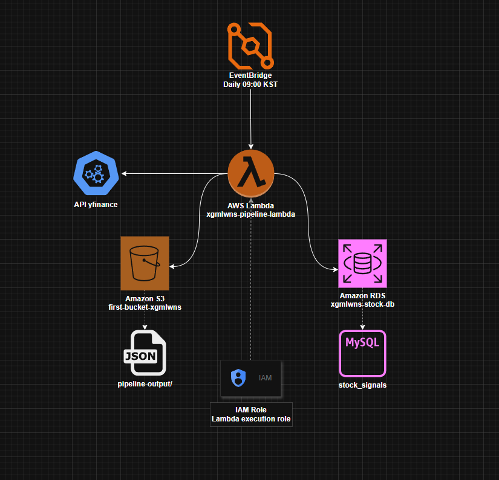
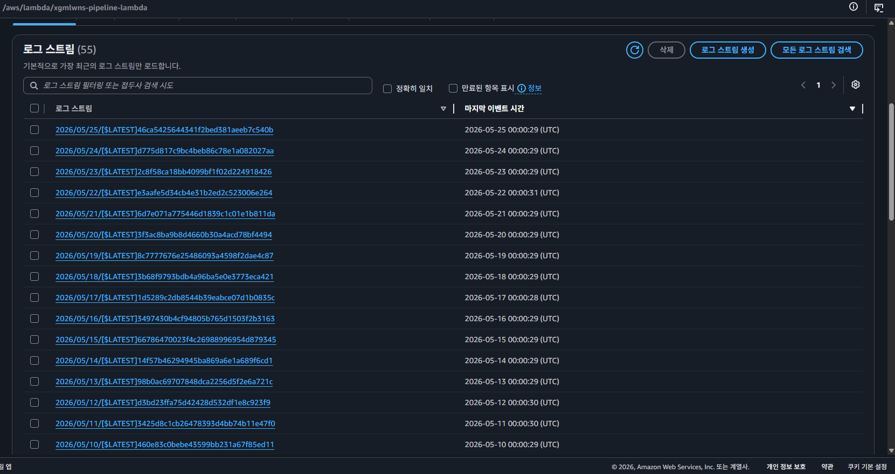
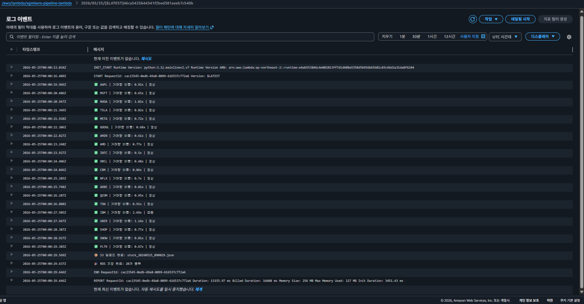
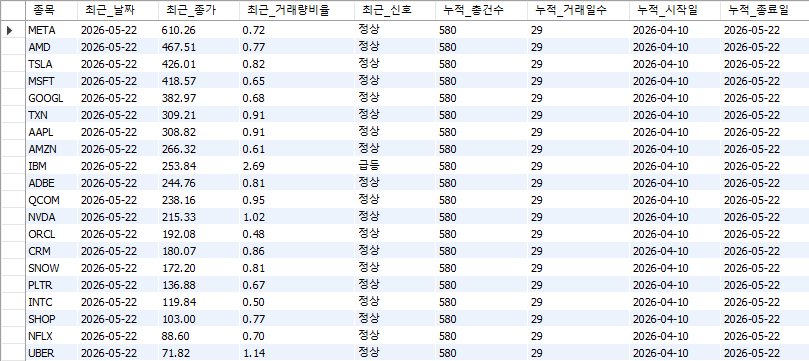

# AWS Serverless Stock Data Pipeline

A serverless data pipeline that automatically collects daily stock data
for 20 major US tech companies, detects abnormal trading volume patterns,
and stores the results in both S3 and RDS MySQL for further analysis.

---

## Architecture



---

## Tech Stack

| Category | Technology |
|------|------|
| Cloud | AWS Lambda, S3, RDS, EventBridge, IAM |
| Language | Python 3.12 |
| Database | MySQL 8.0 (AWS RDS) |
| Data Source | yfinance (Yahoo Finance API) |

---

## Project Structure

```
aws-stock-pipeline/
├── lambda/
│   └── lambda_function.py   # Lambda pipeline code
├── ec2/
│   └── pipeline.py          # EC2-based pipeline code (initial version)
├── sql/
│   └── schema.sql           # RDS table schema
└── README.md
```
---

## Pipeline Logic

1. EventBridge triggers the Lambda function daily at 09:00 KST
2. Fetches 21-day historical data for 20 major US tech stocks via yfinance
3. Calculates volume ratio (today's volume / 20-day average volume)
4. Classifies trade signals based on volume ratio
   - 2.0x or above → Surge
   - 1.5x or above → Caution
   - Otherwise → Normal
5. Saves collected data as a JSON file to S3
6. Inserts records into the RDS MySQL `stock_signals` table

---

## AWS Resources

| Service | Resource | Purpose |
|--------|---------|------|
| Lambda | xgmlwns-pipeline-lambda | Pipeline execution |
| S3 | first-bucket-xgmlwns | JSON data storage |
| RDS | xgmlwns-stock-db | MySQL data storage |
| EventBridge | xgmlwns-pipeline-schedule | Daily 09:00 KST schedule |
| IAM | ec2-s3-role | EC2 → S3 access role |

---

## Results

### Lambda Execution Log
> CloudWatch log stream list (automated daily at 09:00 KST)



> Latest execution log detail (20 tickers saved to RDS & S3)



### Stock Signals Table (RDS)
> Latest stock_signals data with cumulative statistics



---

## Note

- In this practice environment, RDS public access was enabled to reduce costs.
- For production use, a more secure architecture using Lambda inside a VPC with NAT Gateway and private subnets would be considered.
